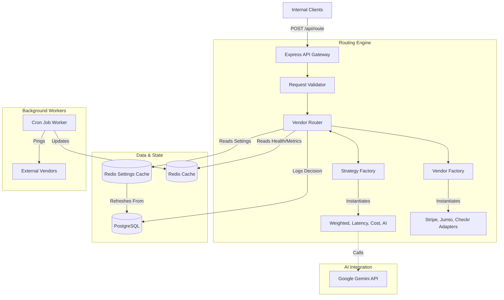

# Intelligent Vendor Routing Platform - Architecture

## System Overview
The Intelligent Vendor Routing Platform acts as a highly available, robust middle-layer between internal applications and external, third-party vendor APIs.

## Key Components

### 1. Vendor Adapters (`src/adapters`)
All external vendors are abstracted behind standard interfaces. This ensures the routing engine never has to worry about vendor-specific API structures. Adapters implement a standard `execute(payload)` method and return a normalized response.

### 2. Strategy Pattern (`src/strategies`)
The platform dynamically chooses how to route traffic using the Strategy Design Pattern.
- `WeightedStrategy`: Uses configured percentages to split traffic.
- `LowestLatencyStrategy`: Queries Redis for the most recent avg latency metrics.
- `LowestCostStrategy`: Selects the cheapest capable vendor.
- `FeatureBasedStrategy`: Forwards the request context to Gemini to make an intelligent runtime decision.

### 3. Health Monitoring & Caching
To ensure sub-millisecond routing decisions, the `HealthMonitor` runs asynchronously in the background via cron. It pings vendors, calculates success rates and latency, and caches the state in Redis. The router reads strictly from Redis rather than pinging vendors on every request.

### 4. Persistence Layer
Every routing decision, including the full request payload, response payload, latency, cost, and routing reason, is persisted asynchronously to PostgreSQL via Prisma ORM for auditing.
