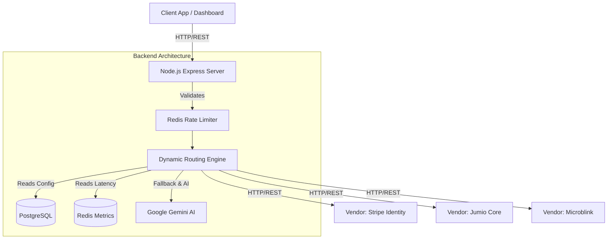
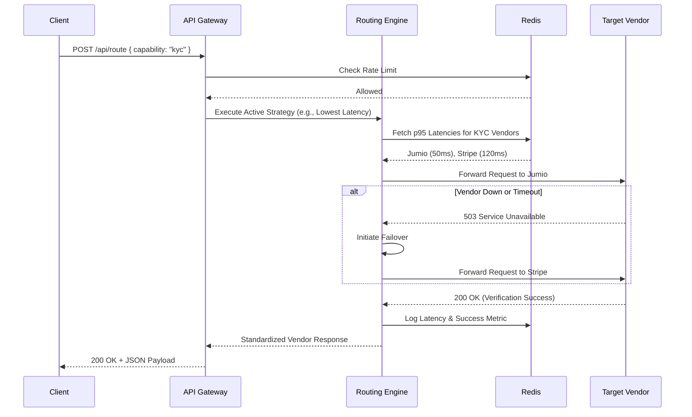
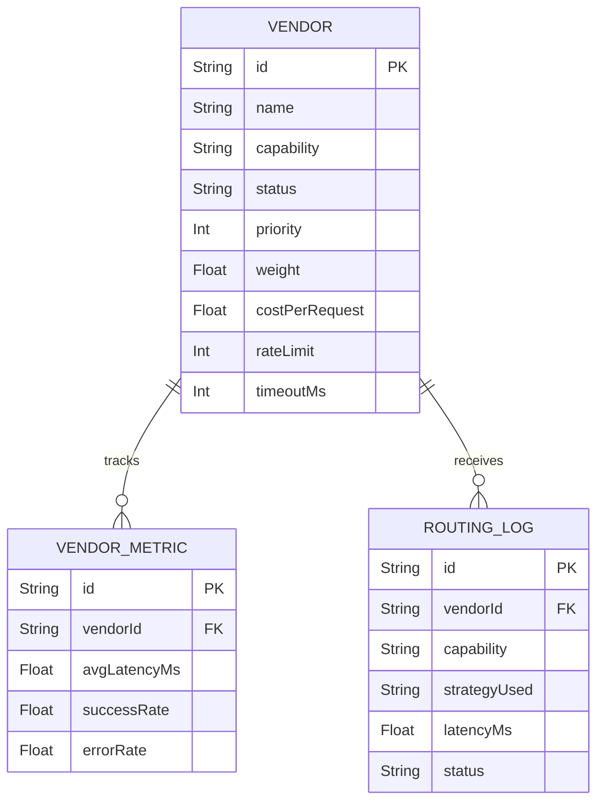

# Intelligent Vendor Routing Platform - Final Deliverables


<div style="page-break-before: always;"></div>

# Intelligent Vendor Routing Platform

A production-grade, AI-powered load balancer and traffic director designed to dynamically route API requests to third-party vendors (e.g., KYC, OCR, Fraud Detection) based on real-time latency, cost optimization, capability matching, and mathematical weighting.

## Key Features
- **Dynamic Routing Engine**: Route requests via Lowest Latency, Lowest Cost, Weighted Load Balancing, or Feature-Based matching.
- **Agentic AI Configuration**: Uses Google Gemini to translate natural English prompts into JSON routing configurations.
- **Automatic Failover**: Instantly detects offline or degraded vendors and reroutes traffic to healthy alternatives.
- **Interactive Dashboard**: Built with React & Vite to monitor active vendors, live traffic distribution, and latency trends.
- **Robust Backend**: Node.js, Express, PostgreSQL (Prisma), and Redis caching.
- **Continuous Integration / Continuous Deployment (CI/CD)**: Automated GitHub Actions pipeline to test backend routing logic, build frontend assets, and verify Docker containers on every commit.

## Mandatory APIs Included
- `POST /api/vendors` - Register a new vendor with capabilities, rate limits, cost, and priority.
- `GET /api/vendors` - Retrieve paginated list of all vendors.
- `POST /api/route` - The core routing engine endpoint.
- `GET /api/vendor-metrics` - Retrieve system health and routing statistics.
- `GET /api/routing-logs` - Retrieve a history of all routing decisions.
- `GET /api/health` - System health check.

---

## 🏗 Architecture Diagram
The architecture relies on a highly scalable, decoupled microservice pattern.



## 🔄 Sequence Diagram (Routing a Request)


## 🗄 Entity-Relationship (ER) Diagram


## 🚀 CI/CD Pipeline (GitHub Actions)
This repository is equipped with a production-ready Continuous Integration and Continuous Deployment (CI/CD) pipeline located at `.github/workflows/ci.yml`. On every `push` and `pull_request` to the `main` branch, GitHub Actions automatically provisions an Ubuntu runner to execute:
1. **Backend Tests:** Spins up ephemeral PostgreSQL and Redis instances, runs Prisma migrations, and executes `npm run test` against the routing engine.
2. **Frontend Builds:** Resolves dependencies and builds the React/Vite dashboard to ensure code compiles flawlessly.
3. **Docker Verification:** Performs a clean `docker compose build` to validate the containerization architecture.

---

## Quickstart (Docker)
1. Provide a `GEMINI_API_KEY` in your `.env` file.
2. Run `docker compose up --build -d`
3. Access the Dashboard at `http://localhost:8080`
4. Access the API at `http://localhost:3000`


<div style="page-break-before: always;"></div>

# Explanation of Routing Decisions

The Intelligent Vendor Routing Platform utilizes a multi-strategy routing engine to dynamically evaluate and select the optimal third-party vendor for any incoming request. Below is the technical breakdown of how the routing decisions are made.

## Strategy Evaluation Hierarchy
When `POST /api/route` is called, the `VendorRouter` executes the active strategy. If no specific strategy is requested by the client, it defaults to the system-wide active strategy (e.g., `LowestCost` or `Weighted`).

### 1. Lowest Latency Strategy
- **Decision Logic:** The system queries the Redis time-series database to retrieve the `p95LatencyMs` (the 95th percentile latency over the last rolling window) for all healthy vendors matching the requested `capability`.
- **Selection:** It strictly sorts the array ascending by latency and selects the lowest value. This prioritizes speed and user experience over financial cost.

### 2. Lowest Cost Strategy
- **Decision Logic:** The engine queries PostgreSQL for the `costPerRequest` values of all healthy, capable vendors. 
- **Selection:** It sorts ascending by cost. This strategy is critical for bulk processing or asynchronous tasks where speed is not the primary factor, but operational budget is.

### 3. Weighted (Load Balancing) Strategy
- **Decision Logic:** The engine acts as a mathematical traffic splitter. It maps the `weight` integer column from the database (e.g., Vendor A: 70, Vendor B: 30) onto a distribution line between 0 and 100.
- **Selection:** It generates a secure random number (0-100). If the number falls between 0-70, it selects Vendor A. If 71-100, Vendor B. This ensures traffic accurately mirrors the configured SLA commitments.

### 4. Feature-Based Matching
- **Decision Logic:** When the request payload strictly requires a specific nested feature (e.g., `requires: ["liveness_check"]`), the engine scans the JSON `metadata.capabilities` column in PostgreSQL.
- **Selection:** Vendors lacking the required sub-capability are entirely filtered out of the pool. The remaining eligible vendors are then sorted by `priority`.

## Failover Mechanisms (Graceful Degradation)
A critical requirement of the routing decision is **resiliency**. 
If the actively selected vendor times out or returns a `503 Service Unavailable` error:
1. The `RoutingEngine` catches the HTTP exception natively.
2. It immediately flags the vendor as `degraded` in Redis.
3. It writes a `RoutingLog` to PostgreSQL with `fallbackReason: "Vendor timeout"`.
4. The router recursively loops, removes the degraded vendor from the eligible array, and passes the payload to the *next* best vendor according to the active strategy.


<div style="page-break-before: always;"></div>

# Agentic AI Integration Usage

This document outlines how Generative AI (Google Gemini) is integrated into the Intelligent Vendor Routing Platform to enhance operational efficiency.

## 1. Natural Language to JSON Configuration
Instead of requiring system administrators to manually write complex JSON syntax to deploy new routing rules, we utilize Google's `gemini-2.5-flash` model as a specialized configuration generator.

### The Workflow
1. **User Prompt**: The administrator types an English prompt in the Dashboard (e.g., *"Route 80% to Stripe Identity and 20% to Jumio"*).
2. **System Prompt Injection**: The Node.js backend intercepts this and wraps it in a strict "System Prompt". This prompt forces the AI into a rigid persona that *must* output valid JSON conforming exactly to the application's Routing Schema, and forbids conversational filler.
3. **Execution**: The backend calls the `generativelanguage.googleapis.com/v1beta/models/gemini-2.5-flash:generateContent` endpoint using the Google AI SDK.
4. **Validation & Deployment**: The returned string is parsed using `JSON.parse()`. If valid, it is presented to the user to instantly update the active routing strategy.

### Prompt Engineering
We utilize structured prompt engineering to guarantee deterministic output. We explicitly provide the schema interface (e.g. `strategy: 'weighted'`, `weights: { Vendor: % }`) so the AI knows exactly what keys to map the English numbers to.

## 2. Graceful Degradation
To ensure enterprise stability, the AI integration is strictly decoupled from the core routing path.
If the Gemini API key is missing, expired, or rate-limited (e.g., HTTP 400 or 429), the `aiController` catches the exception and falls back to a deterministic `getMockConfig()` function. This prevents a third-party AI failure from taking down the routing dashboard.

## Future Possibilities
While the current integration focuses on configuration generation, the framework is designed to support:
- **AI-Driven Anomaly Detection**: Having a scheduled background worker feed the last 24 hours of latency logs into the LLM to identify sub-optimal routing patterns.
- **Predictive Scaling**: Asking the LLM to analyze traffic distribution and predict cost overruns before they occur.


<div style="page-break-before: always;"></div>

# Sample API Requests & Responses

## 1. Register a New Vendor (POST `/api/vendors`)
**Request:**
```http
POST /api/vendors
Content-Type: application/json

{
  "name": "Acme Identity Verification",
  "capability": "kyc",
  "priority": 2,
  "weight": 40,
  "costPerRequest": 0.50,
  "rateLimit": 200,
  "timeoutMs": 2500,
  "supportedFeatures": ["kyc", "liveness_check"]
}
```

**Response (201 Created):**
```json
{
  "success": true,
  "message": "Vendor created successfully",
  "data": {
    "id": "e4b2d1c3-4a5f-4a6b-8c7d-9e0f1a2b3c4d",
    "name": "Acme Identity Verification",
    "capability": "kyc",
    "status": "healthy",
    "costPerRequest": 0.5,
    "rateLimit": 200,
    "metadata": {
      "capabilities": ["kyc", "liveness_check"]
    }
  }
}
```

## 2. Route a Request (POST `/api/route`)
**Request:**
```http
POST /api/route
Content-Type: application/json

{
  "capability": "kyc",
  "routing_preference": "lowest_cost",
  "payload": {
    "userId": "user_88321",
    "documentType": "passport",
    "image": "base64_encoded_string_here"
  },
  "requirements": {
    "maxLatencyMs": 3000,
    "preferLowCost": true
  }
}
```

**Response (200 OK):**
```json
{
  "success": true,
  "data": {
    "requestId": "r_99214ab",
    "vendorUsed": "Jumio Core",
    "strategyUsed": "lowest_cost",
    "latencyMs": 142.5,
    "cost": 0.80,
    "response": {
      "verificationStatus": "APPROVED",
      "confidenceScore": 0.98
    }
  }
}
```

## 3. Generate Agentic Routing Config (POST `/api/ai/generate-config`)
**Request:**
```http
POST /api/ai/generate-config
Content-Type: application/json

{
  "prompt": "Route 80 percent of traffic to Stripe Identity and the remaining 20 percent to Jumio Core. If they fail, drop the max latency to 2000."
}
```

**Response (200 OK):**
```json
{
  "success": true,
  "data": {
    "strategy": "weighted",
    "config": {
      "weights": {
        "Stripe Identity": 80,
        "Jumio Core": 20
      }
    },
    "failover": {
      "max_latency_ms": 2000
    },
    "reasoning": "The prompt explicitly states percentages for traffic distribution between vendors, which translates to a 'weighted' routing strategy. It also specifies a failover condition for latency."
  }
}
```


<div style="page-break-before: always;"></div>

## Sample Vendor Configurations

```json
[
  {
    "name": "Stripe Identity",
    "baseUrl": "https://api.stripe.com/v1/identity",
    "capability": "kyc",
    "priority": 1,
    "weight": 70,
    "costPerRequest": 1.50,
    "rateLimit": 100,
    "timeoutMs": 2000,
    "status": "healthy",
    "metadata": {
      "capabilities": ["kyc", "document_verification", "selfie_match"],
      "region": "us-east-1"
    }
  },
  {
    "name": "Jumio Core",
    "baseUrl": "https://api.jumio.com/api/net/v2",
    "capability": "kyc",
    "priority": 2,
    "weight": 30,
    "costPerRequest": 0.80,
    "rateLimit": 50,
    "timeoutMs": 3500,
    "status": "healthy",
    "metadata": {
      "capabilities": ["kyc", "aml", "age_verification"],
      "region": "eu-central-1"
    }
  },
  {
    "name": "Microblink OCR",
    "baseUrl": "https://api.microblink.com/recognize",
    "capability": "ocr",
    "priority": 1,
    "weight": 100,
    "costPerRequest": 0.15,
    "rateLimit": 500,
    "timeoutMs": 1000,
    "status": "healthy",
    "metadata": {
      "capabilities": ["ocr", "id_barcode_parsing"],
      "accuracy": 0.99
    }
  }
]

```

