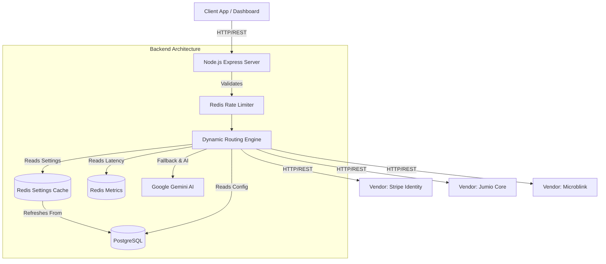
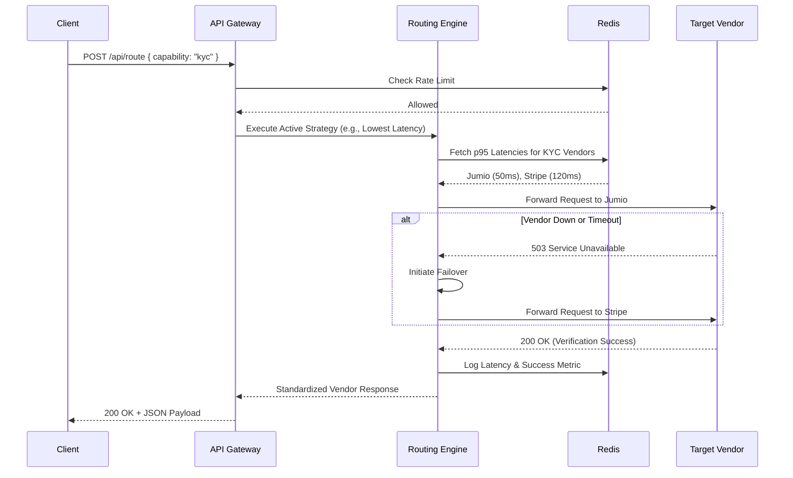
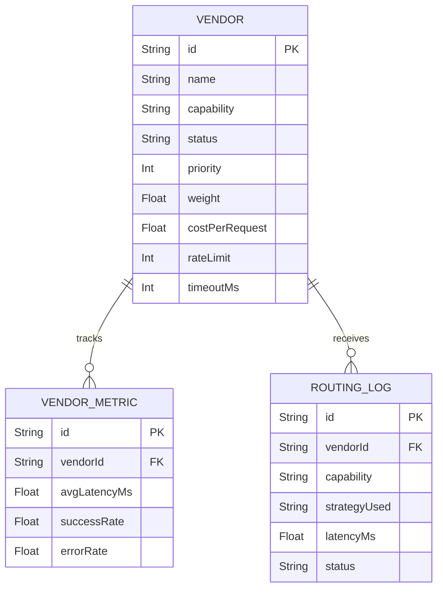

# Intelligent Vendor Routing Platform

**🌐 Live Production Dashboard:** [https://frontend-drab-psi-qrk3ksyoio.vercel.app/](https://frontend-drab-psi-qrk3ksyoio.vercel.app/)

A production-grade, AI-powered load balancer and traffic director designed to dynamically route API requests to third-party vendors (e.g., KYC, OCR, Fraud Detection) based on real-time latency, cost optimization, capability matching, and mathematical weighting.

## Key Features
- **Dynamic Routing Engine**: Route requests via Lowest Latency, Lowest Cost, Weighted Load Balancing, or Feature-Based matching.
- **Agentic AI Configuration**: Uses Google Gemini to translate natural English prompts into JSON routing configurations.
- **Automatic Failover**: Instantly detects offline or degraded vendors and reroutes traffic to healthy alternatives.
- **Interactive Dashboard**: Built with React & Vite to monitor active vendors, live traffic distribution, and latency trends.
- **Robust Backend**: Node.js, Express, PostgreSQL (Prisma), and Redis caching.
- **Dynamic Global Settings**: Modify core routing thresholds (latency, timeouts) via PostgreSQL in real-time without server restarts.
- **Strict Agentic AI Mode**: Enforce deterministic safety rails to prevent AI fallback generation when API keys are missing.
- **Continuous Integration / Continuous Deployment (CI/CD)**: Automated GitHub Actions pipeline to test backend routing logic, build frontend assets, and verify Docker containers on every commit.

## Mandatory APIs Included
- `POST /api/vendors` - Register a new vendor with capabilities, rate limits, cost, and priority.
- `GET /api/vendors` - Retrieve paginated list of all vendors.
- `POST /api/route` - The core routing engine endpoint.
- `GET /api/vendor-metrics` - Retrieve system health and routing statistics.
- `GET /api/routing-logs` - Retrieve a history of all routing decisions.
- `GET /api/health` - System health check.
- `GET /api/settings` - Retrieve global routing settings.
- `PUT /api/settings` - Update global routing settings.

---

## 🏗 Architecture Diagram
The architecture relies on a highly scalable, decoupled microservice pattern.

## 🔄 Sequence Diagram (Routing a Request)

## 🗄 Entity-Relationship (ER) Diagram

## 🚀 CI/CD Pipeline (GitHub Actions)
This repository is equipped with a production-ready Continuous Integration and Continuous Deployment (CI/CD) pipeline located at `.github/workflows/ci.yml`. On every `push` and `pull_request` to the `main` branch, GitHub Actions automatically provisions an Ubuntu runner to execute:
1. **Backend Tests:** Spins up ephemeral PostgreSQL and Redis instances, runs Prisma migrations, and executes `npm run test` against the routing engine.
2. **Frontend Builds:** Resolves dependencies and builds the React/Vite dashboard to ensure code compiles flawlessly.
3. **Docker Verification:** Performs a clean `docker compose build` to validate the containerization architecture.

---

## Quickstart (Docker)
1. Provide a `GEMINI_API_KEY` in your `.env` file.
2. Run `docker compose up --build -d`
3. Access the Dashboard at `http://localhost:8080`
4. Access the API at `http://localhost:3000`
