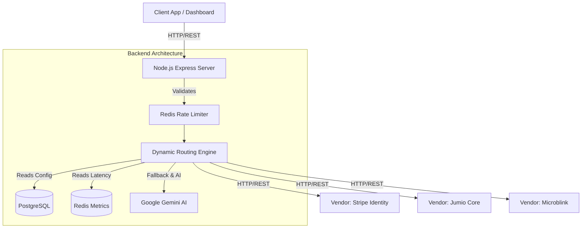
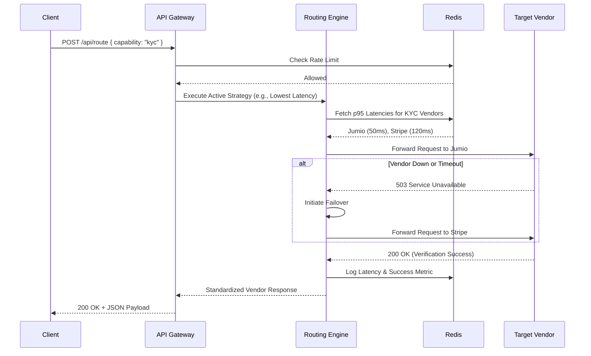
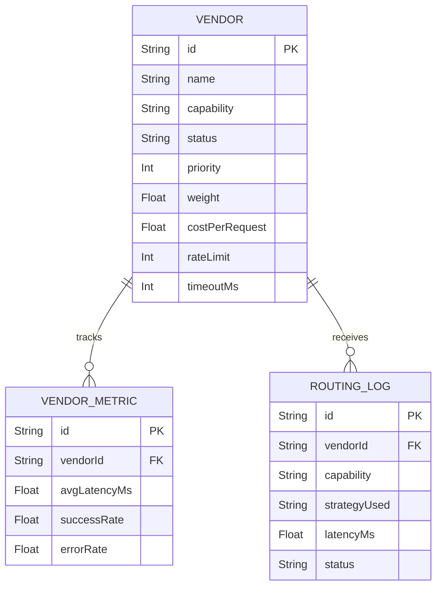

# Intelligent Vendor Routing Platform

A production-grade, AI-powered load balancer and traffic director designed to dynamically route API requests to third-party vendors (e.g., KYC, OCR, Fraud Detection) based on real-time latency, cost optimization, capability matching, and mathematical weighting.

## Key Features
- **Dynamic Routing Engine**: Route requests via Lowest Latency, Lowest Cost, Weighted Load Balancing, or Feature-Based matching.
- **Agentic AI Configuration**: Uses Google Gemini to translate natural English prompts into JSON routing configurations.
- **Automatic Failover**: Instantly detects offline or degraded vendors and reroutes traffic to healthy alternatives.
- **Interactive Dashboard**: Built with React & Vite to monitor active vendors, live traffic distribution, and latency trends.
- **Robust Backend**: Node.js, Express, PostgreSQL (Prisma), and Redis caching.

## Mandatory APIs Included
- `POST /api/vendors` - Register a new vendor with capabilities, rate limits, cost, and priority.
- `GET /api/vendors` - Retrieve paginated list of all vendors.
- `POST /api/route` - The core routing engine endpoint.
- `GET /api/vendor-metrics` - Retrieve system health and routing statistics.
- `GET /api/routing-logs` - Retrieve a history of all routing decisions.
- `GET /api/health` - System health check.

---

## 🏗 Architecture Diagram
The architecture relies on a highly scalable, decoupled microservice pattern.

## 🔄 Sequence Diagram (Routing a Request)

## 🗄 Entity-Relationship (ER) Diagram

---

## Quickstart (Docker)
1. Provide a `GEMINI_API_KEY` in your `.env` file.
2. Run `docker compose up --build -d`
3. Access the Dashboard at `http://localhost:8080`
4. Access the API at `http://localhost:3000`
